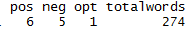

[](http://quantlet.de/index.php?p=info)

## [](http://quantlet.de/) **Countword** [](http://quantlet.de/d3/ia)


```yaml
Name of QuantLet:  'Countword'

Published in:       

Description:       'Counts positive and negative words using the lexicon by Bing Liu'

Keywords:          'text, nlp, tokenization, opinion mining, media news, sentiment'

See also:           

Author:            'Guo Li'

Submitted:         'Mon, September 5 2015 by Guo Li'

Datafile:          'positve-words.txt negative-words.txt example.txt'

Input:  

Output:           

Example:            
```




```R
setwd("C:~")
library("methods")
a                                                         = readLines("example.txt")

neg                                                       = readLines("negative-words.txt")
pos                                                       = readLines("positive-words.txt")

# function score.sentiment
score.sentiment                                           = function(sentence, pos.words, neg.words)
{
  # remove punctuation
  sentence                                                = gsub("[[:punct:]]", "", sentence)
  # remove control characters
  sentence                                                = gsub("[[:cntrl:]]", "", sentence)
  # remove digits?
  sentence                                                = gsub('\\d+', '', sentence)
  
  # define error handling function when trying tolower
  tryTolower                                              = function(x)
  {
    # create missing value
    y                                                     = NA
    # tryCatch error
    try_error                                             = tryCatch(tolower(x), error=function(e) e)
    # if not an error
    if (!inherits(try_error, "error"))
      y                                                   = tolower(x)
    # result
    return(y)
  }
  # use tryTolower with sapply 
  sentence                                                = sapply(sentence, tryTolower)
  
  # split sentence into words with str_split (stringr package)
  word.list                                               = strsplit(sentence, "\\s+")
  words                                                   = unlist(word.list)
  
  # compare words to the dictionaries of positive & negative terms
  pos.matches                                             = match(words, pos.words)
  neg.matches                                             = match(words, neg.words)
  
  # get the position of the matched term or NA
  # we just want a TRUE/FALSE
  pos.matches                                             = !is.na(pos.matches)
  neg.matches                                             = !is.na(neg.matches)
  
  # final score
  score                                                   = sum(pos.matches) - sum(neg.matches)
  pos                                                     = sum(pos.matches)
  neg                                                     = sum(neg.matches)
  num                                                     = length(pos.matches)
  sent                                                    = matrix(c(pos,neg,score,num),nrow=1)
  scores.df                                               = data.frame(score=sent)
  
  names(scores.df)                                        = c("pos","neg","opt","totalwords")
  scores.df
}

#sent = paste(rep(sentences,3),collapse="")
score.sentiment(a, pos, neg) 


```
