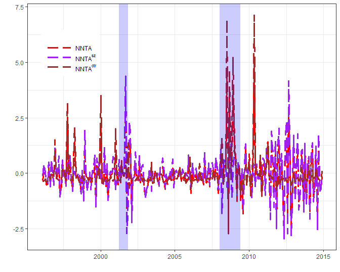

[](http://quantlet.de/index.php?p=info)

## [](http://quantlet.de/) **NNTAplot** [](http://quantlet.de/d3/ia)

```yaml

Name of QuantLet:  'NNTAplot'

Published in:      'Media Network Based Investors’ Attention: A Powerful Predictor of Market Premium'

Description:       'Plot News Network Trigered Investor Attention Indices (NNTA) with its 2 components (value weighted NNTA index, NNTA^{sz}, and eigenvector centrality weighted NNTA index, NNTA^{ctr}.)'

Keywords:          'Plot, Time-series, Investor Attention, Media News, Return Predictability'

See also:          'NNTAcsfe, NNTAoos'

Author:            'Guo Li'

Submitted:         'Fri, June 29 2018 by Guo Li'

Datafile:          'NNTAdata.csv'
```


