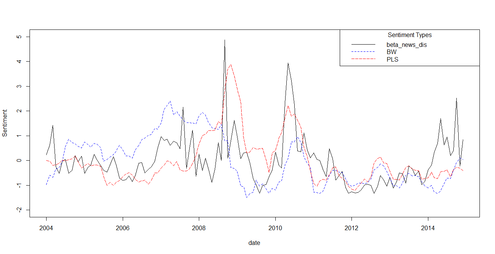
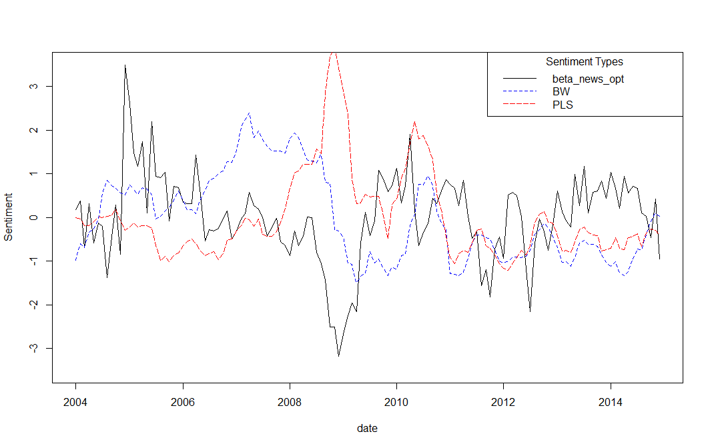

[](http://quantlet.de/index.php?p=info)

## [](http://quantlet.de/) **Speculationnews** [](http://quantlet.de/d3/ia)

```yaml

Name of QuantLet : Speculationnews

Description : 'Plot market wide news optimism index and news disagreement index weighted by
individual firm''s market beta.'

Keywords : Plot, Text Mining, Time-series, Media News, Sentiment, Disagreement

Author : Guo Li

Submitted : Mon, September 5 2016 by Guo Li

Datafile : StreamReuters.RData, F-F_Research_Data_Factors_daily.CSV, disfinal.csv

Output : BetaFinal.csv

```






### R Code:
```r
NA
```
